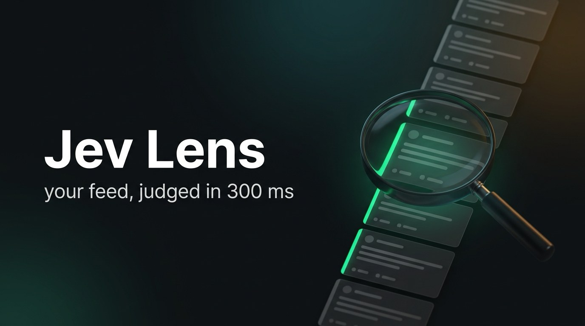
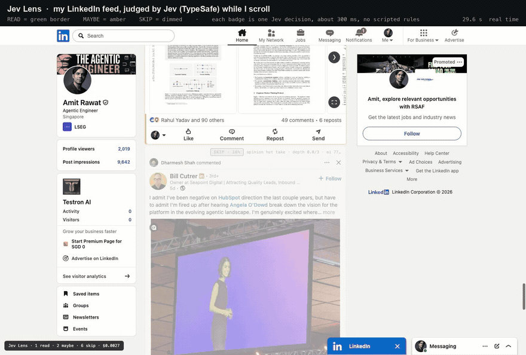
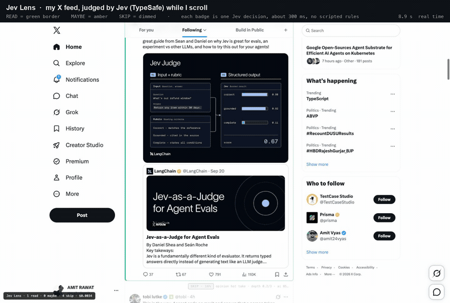
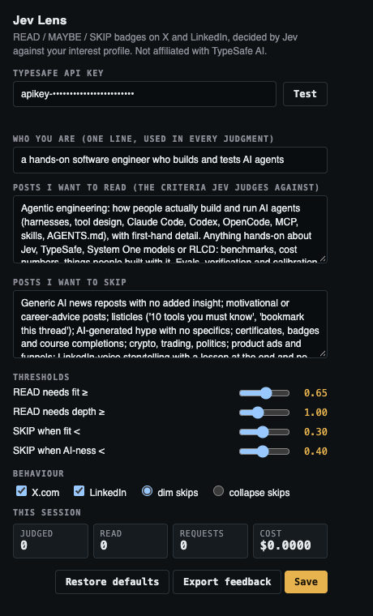

<p align="center"></p>

# Jev Lens

**Your feed, judged in 300 ms.** A Chrome extension that badges every X and LinkedIn post **READ / MAYBE / SKIP** as it scrolls into view, decided by [Jev](https://docs.typesafe.ai) (TypeSafe AI's calibrated decision model) against an interest profile you write in plain English. READ posts get a green border. SKIP posts fade out. Ads and promoted posts are skipped without a call.

No scripted rules, no keyword lists, no cloud account of ours. Your API key, your profile, your browser.

<p align="center"></p>
<p align="center"><em>LinkedIn, real time. Two READs (an NVIDIA harness paper, a Jev verifier build log) between dimmed promoted posts and job news.</em></p>

<p align="center"></p>
<p align="center"><em>X, real time. "Jev-as-a-Judge for Agent Evals" and a Jev benchmark get READ; hot takes and a figurine ad get dimmed.</em></p>

## Why

Feeds are mostly noise. Keyword filters can't tell a build log from a certificate announcement, and asking an LLM about every post is slow and expensive. Jev is different: it does not generate text, it returns typed decisions with calibrated probabilities in about 300 ms, and it costs $0.042 per million input tokens with output free. That makes "judge every post before I reach it" practical: roughly **3 cents per 1,000 posts**.

## Install (2 minutes, no store)

1. Download or clone this repo.
2. Open `chrome://extensions`, turn on **Developer mode** (top right), click **Load unpacked**, pick the `extension/` folder. Nothing else happens at this point: there is no setup wizard, and the extension stays idle until you give it a key.
3. **Open the settings.** Click the puzzle-piece (Extensions) button in Chrome's toolbar, find **Jev Lens**, and click the pin so its icon stays on the toolbar. Then click the Jev Lens icon: the panel below drops down. That panel is the whole configuration screen.
4. Paste your TypeSafe API key, click **Test** (it should say `key ok · models: jev-latest, jev-preview`), click **Save**.
5. Open [x.com/home](https://x.com/home) or [linkedin.com/feed](https://www.linkedin.com/feed/), reload the tab once, and scroll. Until a key is saved, posts show a small red `jev: no API key` badge instead of a verdict.

You do not need to touch the sliders to start; the defaults are the tuned ones. Come back to the popup only to change your profile or thresholds, then Save and reload the feed tab.

Chrome will not install extensions from outside the Web Store as `.crx` files, so "Load unpacked" is the intended path. Works on macOS, Windows and Linux; Windows shows a "disable developer mode extensions" banner on startup that you can dismiss.

You need a TypeSafe API key. Jev is in early access at the time of writing: join the waitlist at [typesafe.ai](https://typesafe.ai) and create a key in the console.

<p align="center"></p>

## Make it yours

Everything Jev judges against is in the popup, in plain English:

- **Who you are**: one sentence, used in every judgment. *"a hands-on software engineer who builds and tests AI agents"*.
- **Posts I want to read**: topics, angles and two or three example posts you would stop for.
- **Posts I want to skip**: the noise you are tired of. Examples help more than adjectives.
- **Thresholds**: how sure Jev must be before a post is READ, and below what it becomes SKIP.

Jev reads literally. "Advanced AI" does nothing; "RL post-training explained hands-on, including repos you can run" does. Name topics, name anti-patterns, give examples. Click **Save**, reload the feed tab, scroll.

The defaults ship with an agentic-engineering lens (agents, harnesses, evals, AI in testing). Replace them with anything: design, biotech, climate policy, your industry's trade press. The mechanics do not care.

### Teach it with two clicks

Hover any badge and you get **read** / **skip** buttons. Click one when Jev got it wrong. Every click is stored locally with the post text and Jev's answers; **Export feedback** in the popup gives you a JSON file. Read it once a week, tighten the profile where the misses cluster. That is the whole tuning loop, and it is how the default profile was built: 96 posts graded by hand, three rounds, from 76% agreement to 86-91%.

## How a post is judged

Posts are observed 800 px before they enter the viewport, batched up to 8 per request, and sent to `POST https://api.typesafe.ai/v1/systemone` with four questions each:

| question | Jev primitive | what it answers |
| --- | --- | --- |
| `is_ai` | Noul | is the post substantively about your field (default: AI / agents / AI tooling / AI in testing) |
| `kind` | Choice | research_or_release, practitioner_insight, tool_launch, tutorial, opinion_hot_take, news_repost, listicle_or_bait, self_promo_or_job, not_ai |
| `depth` | Score 0-3 | slogan → one claim → mechanism, numbers or first-hand detail → novel, actionable insight |
| `fit` | Noul | "the reader would stop scrolling for this", judged against your profile (true) and anti-profile (false) |

The verdict is computed in code, so you can read it and change it:

```
SKIP   if kind = listicle_or_bait, or is_ai < 0.40, or fit < 0.30
SKIP   if kind = self_promo_or_job and fit < 0.60
READ   if fit ≥ 0.65 and depth ≥ 1.0 and kind ≠ news_repost
READ   if fit ≥ 0.80                      (strong fit wins even when truncated text kept depth low)
MAYBE  otherwise
```

The "why" line next to each badge shows kind, depth, AI-ness and the request latency, so you always see the reasoning without needing a rationale.

Two things learned while tuning that you may find useful in your own Jev projects: batching 8 posts per request scored *better* than one at a time (the neighbours give Jev a comparative frame), and the biggest miss was a category rule, not the model: "author shares their own technical write-up" was landing in `self_promo_or_job`. The category definitions now spell that out.

## Privacy and conduct

- Jev Lens **reads the page and styles it**. It never likes, follows, hides, reposts, posts or opens messages.
- Post text (author, text, a few flags) is sent to TypeSafe under **your** key. Nothing goes anywhere else. Your key lives in `chrome.storage.local` on your machine and is never written to the page or to this repo.
- Feedback you record stays local until you export it.
- Use it on your own feeds, at human scrolling speed. It is a reading aid, not a scraper.

Not affiliated with TypeSafe AI, X or LinkedIn.

## Layout

```
extension/               the unpacked extension: Manifest V3, plain JS, no build step
  adapters/x.js            finds tweets: article[data-testid="tweet"]; ads via the placementTracking wrapper
  adapters/linkedin.js     finds posts: [data-testid="mainFeed"] div[role="listitem"][componentkey^="update-card-focus"]
  content.js               observers (rooted on the feed's own scroll container), batching, badges, feedback buttons
  worker.js                API key, the four questions, verdict rules, stats, feedback store
  popup.html / popup.js    settings
harness/                 optional: drive a Chrome over CDP to load, verify, record and grade the extension
```

Adding a site is one adapter file exposing `{ site, root(), posts(), extract(el) }` plus a `content_scripts` entry in the manifest. LinkedIn changes its markup often; if badges stop appearing there, the adapter is the place to look.

## Harness (optional)

```bash
cd harness && npm install
# Chrome started with: --remote-debugging-port=9222 --enable-unsafe-extension-debugging
node load_extension.mjs /absolute/path/to/extension   # loads the unpacked extension over CDP
node verify_feed.mjs linkedin                          # scrolls a feed, asserts badges/borders/dimming, exit 0 on pass
node record_feed.mjs x artifacts/take1 60             # screencast + human-like scroll + a log of every judged post
```

## Cost

$0.042 per million input tokens, output free. A post with the four questions is 350-600 tokens (batching shares the profile text), so a heavy day of scrolling is under a cent. The counter bottom-left of the page shows the running session cost.

## License

MIT.
